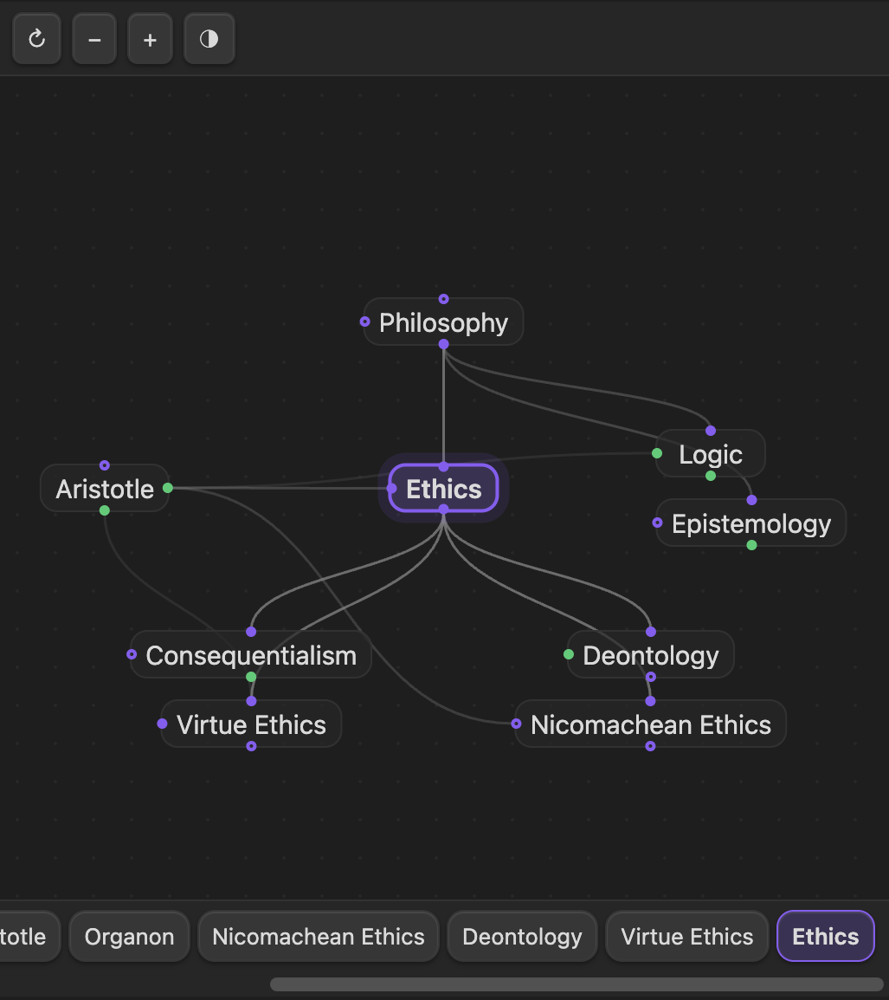

# Synapses



Synapses lays out your note links as a focused graph: the active note sits in the center with its
**parents above, children below, jumps to the left, and siblings to the right**. Click a card to
**activate** that note, drag a handle to create a link, or hover a connector to remove one — a fast way
to navigate, add, remove, and edit the connections between your notes.

It runs in both **Obsidian** and **Logseq**, reading and writing the same ExcaliBrain-style page
properties.

> This plugin was written with LLM assistance.

## Links are page properties

Links are declared with page properties (ExcaliBrain-style), on a note's first block or in YAML
frontmatter:

```md
parent:: [[Philosophy]]
child:: [[Ethics]], [[Logic]]
jump:: [[Aristotle]]
```

You only declare one direction — the reciprocal (parent↔child) and symmetric jumps are inferred, and
siblings are computed.

### Editing properties in place

When Synapses links or unlinks notes it edits link properties **in place**. If your note template
prefills `parent:: / child:: / jump::` — whether as an inline field anywhere in the note (top, middle,
or bottom) or as a key in the YAML frontmatter — Synapses updates that existing value instead of
prepending a duplicate at the top. Brand-new properties are added as inline fields.

## Obsidian

**Requires the [Dataview](https://github.com/blacksmithgu/obsidian-dataview) plugin** — Synapses reads
your `parent:: / child:: / jump::` inline fields through Dataview's index.

1. Install **Dataview** from Community Plugins and enable it.
2. Install **Synapses** (from Community Plugins once published, or via
   [BRAT](https://github.com/TfTHacker/obsidian42-brat) for betas) and enable it.
3. Open the view from the **🧠** ribbon icon, or run the command **Synapses: Open in sidebar**.

Configure which property names map to parent / child / jump under **Settings → Synapses**.

## Logseq (0.10.x — Markdown/file graph)

1. Logseq → **Settings → Advanced → Developer mode** = on.
2. **Plugins → Load unpacked plugin** → select `packages/logseq-plugin` (build first; see below).
3. Click the **🧠** toolbar button, or run the slash command **`/Synapses: open in sidebar`**.

## Develop

This is a TypeScript monorepo: `packages/core` (editor-agnostic engine + view), `packages/obsidian-plugin`,
and `packages/logseq-plugin`.

```sh
npm install      # first time
npm run build    # builds core + both plugins (obsidian → main.js/styles.css, logseq → dist/)
npm test         # run the unit tests (vitest)
```

Add `-w <package>` to build one package, or `npm run dev -w obsidian-plugin` to rebuild on change
(reload the plugin in the editor to pick up the new bundle).

## Inspiration & credits

- **[TheBrain](https://www.thebrain.com)** — its spatial "Plex" interface, with the active note
  centered and its relations fanning out around it, is the inspiration for this layout.
- **[Logseq](https://logseq.com)** — a host application this extends; it provides the Markdown graph,
  page properties, and plugin platform.
- **[Obsidian](https://obsidian.md)** — the second host application this extends; its `ItemView` API
  backs the in-process Obsidian adapter.
- **[Dataview](https://github.com/blacksmithgu/obsidian-dataview)** — its inline-field index and query
  API are how the Obsidian adapter reads `parent:: / child:: / jump::` links.
- **[ExcaliBrain](https://github.com/zsviczian/excalibrain)** — its page-property data model
  (`parent:: / child:: / jump::`, declared one direction with reciprocals inferred) is the basis for how
  links are stored.
- **[BRAT](https://github.com/TfTHacker/obsidian42-brat)** — the beta-reviewers' tool used to install
  and update this from GitHub Releases.

## License

[MIT](LICENSE) © qoob23
